# 4. Projeto de Interface

Pré-requisitos: <a href="2-Especificação do Projeto.md"> Documentação de Especificação</a>

Visão geral da interação do usuário pelas telas do sistema e protótipo interativo das telas com as funcionalidades que fazem parte do sistema (wireframes).

 Apresente as principais interfaces da plataforma. Discuta como ela foi elaborada de forma a atender os requisitos funcionais, não funcionais e histórias de usuário abordados nas <a href="2-Especificação do Projeto.md"> Documentação de Especificação</a>.

## 4.1. Diagrama de Fluxo

### 4.1.1. Tela de entrada

### 4.1.2. Tela de cadastro padrão

### 4.1.3. Processo e trâmite

## 4.2. Wireframes

### 4.2.1 Tela - Inicial

Após o desenvolvimento, o resultado foi alterado.

### 4.2.2 Tela - Consulta Pública de Processos

Após o desenvolvimento, o resultado foi alterado.

### 4.2.3 Tela - Resultado da busca

Após o desenvolvimento, o resultado foi alterado.

### 4.2.5 Tela - DashBoard

Após o desenvolvimento, o resultado foi alterado.

### 4.2.6 Tela - Listagem Usuários

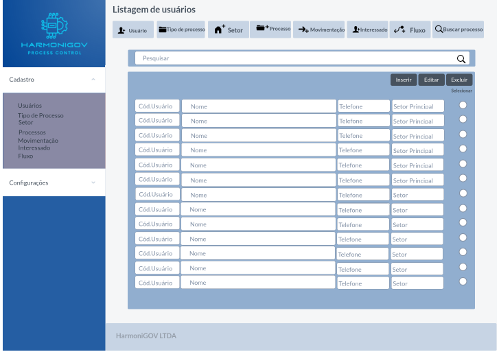

Após o desenvolvimento, o resultado foi alterado.

### 4.2.7 Tela - Cadastro/Edição Usuários

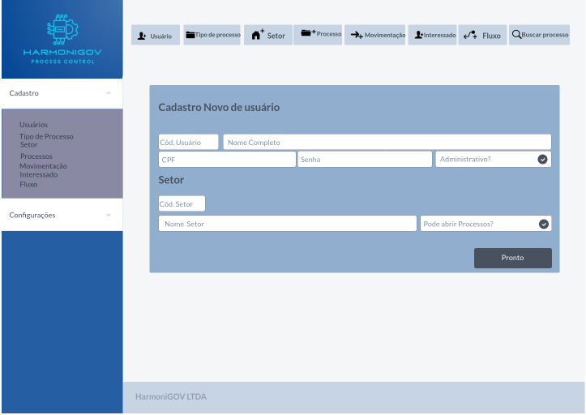

Após o desenvolvimento, o resultado foi alterado.

### 4.2.8 Tela - Listagem Tipo de Processo

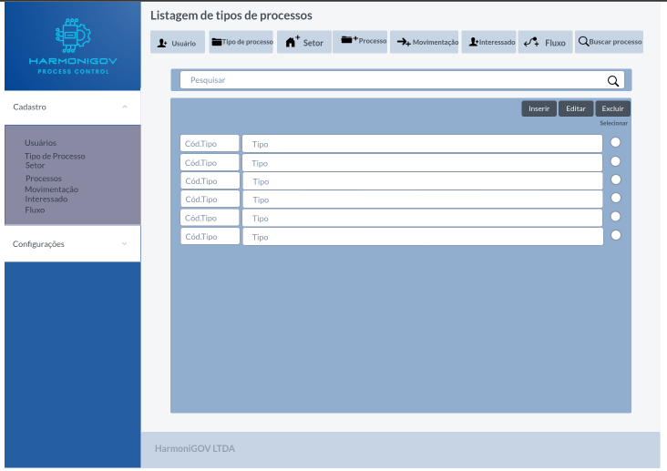

Após o desenvolvimento, o resultado foi alterado.

### 4.2.9 Tela - Cadastro/Edição de Tipo de Processo

Após o desenvolvimento, o resultado foi alterado.

### 4.2.10 Tela - Listagem Setor

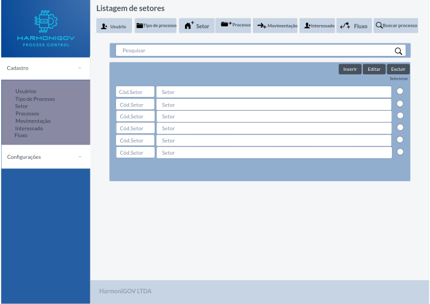

Após o desenvolvimento, o resultado foi alterado.

### 4.2.11 Tela - Cadastro/Edição de Setor

Após o desenvolvimento, o resultado foi alterado.

### 4.2.12 Tela - Listagem Processos

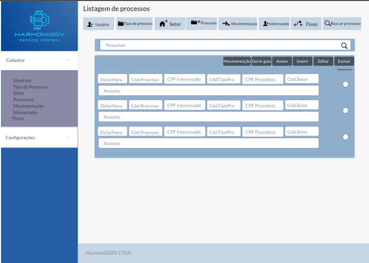

Após o desenvolvimento, o resultado foi alterado.

### 4.2.13 Tela - Cadastro/Edição de Processos

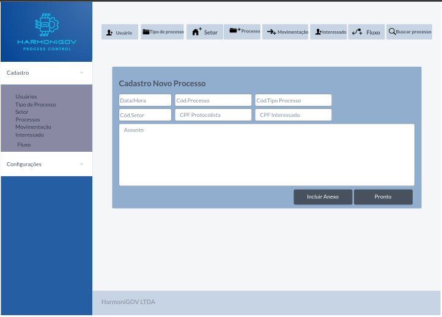

Após o desenvolvimento, o resultado foi alterado.

### 4.2.14 Tela - Listagem Movimentação

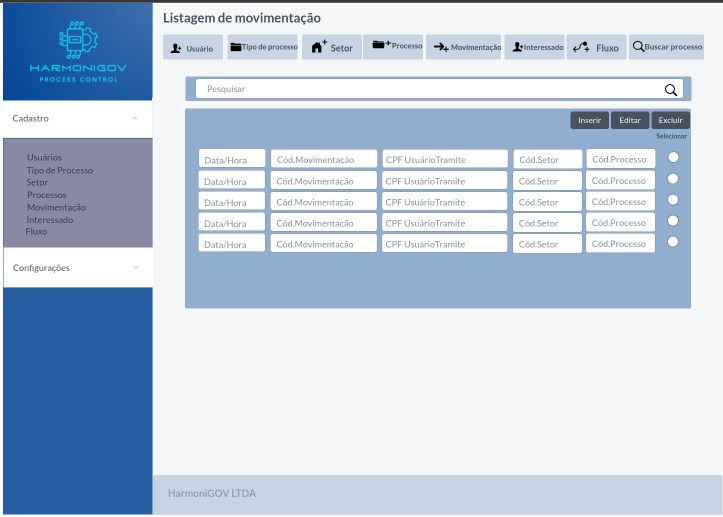

Após o desenvolvimento, o resultado foi alterado.

### 4.2.15 Tela - Cadastro/Edição de Movimentação

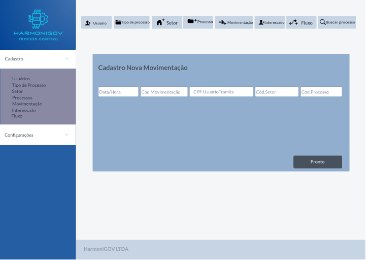

Após o desenvolvimento, o resultado foi alterado.

### 4.2.16 Tela - Listagem Interessado

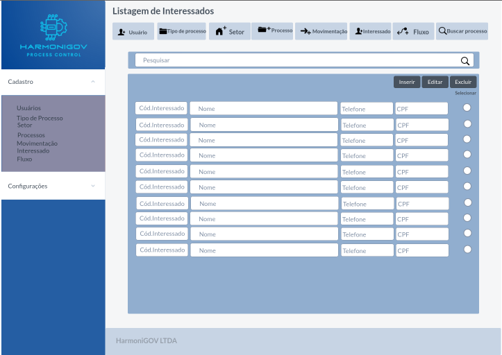

Após o desenvolvimento, o resultado foi alterado.

### 4.2.17 Tela - Cadastro/Edição de Interessado

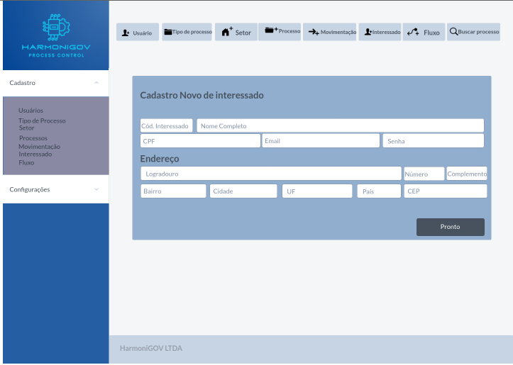

Após o desenvolvimento, o resultado foi alterado.

### 4.2.18 Tela - Listagem Fluxo

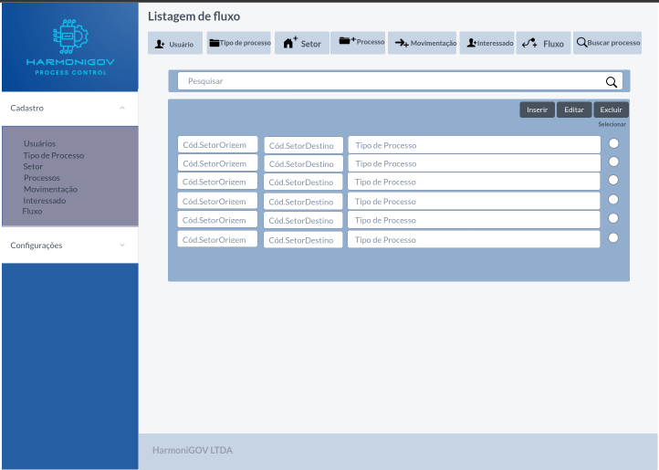

Após o desenvolvimento, o resultado foi alterado.

### 4.2.19 Tela - Cadastro/Edição de Fluxo

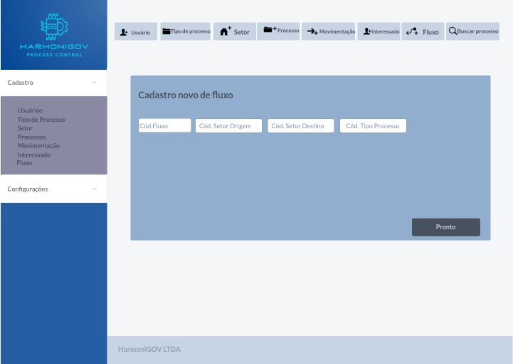

Após o desenvolvimento, o resultado foi alterado.

