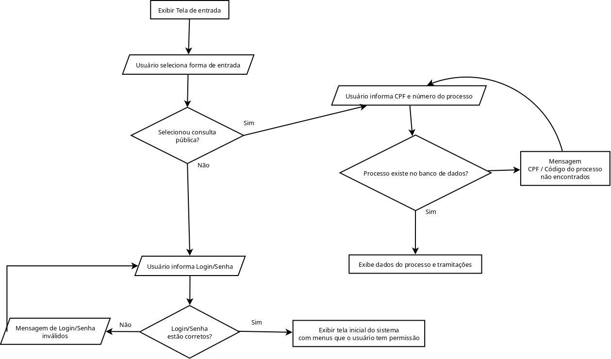
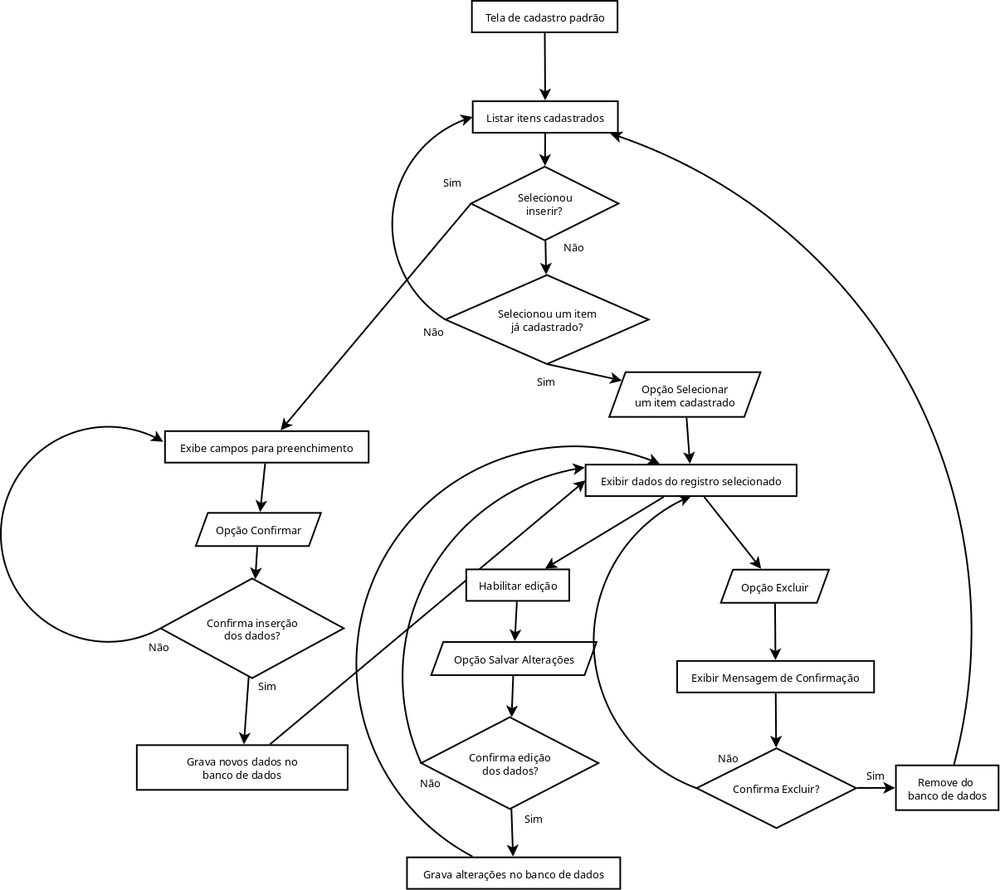
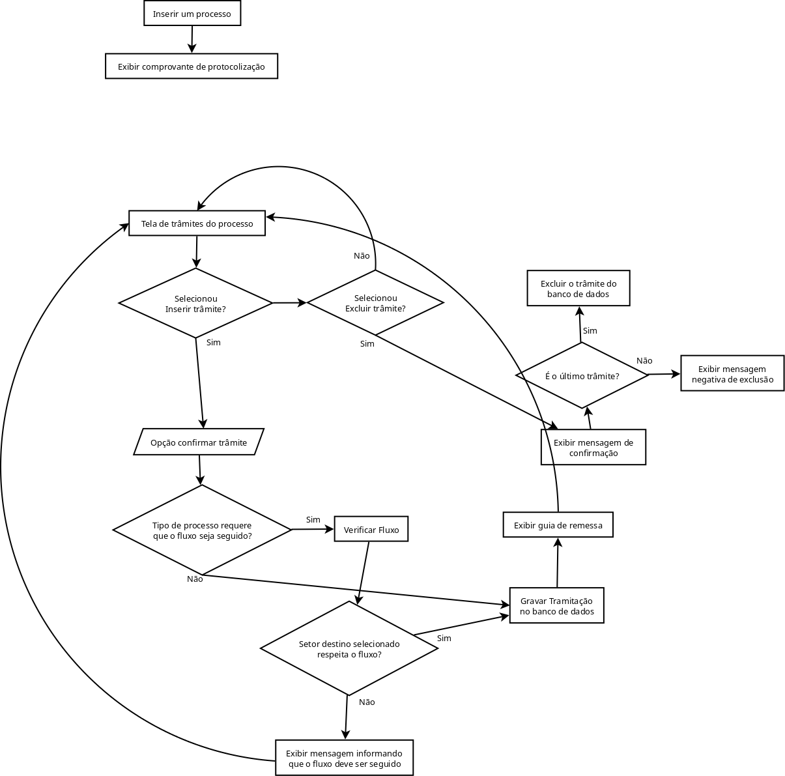
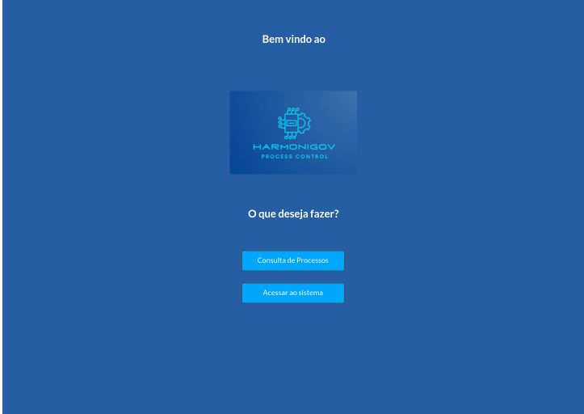
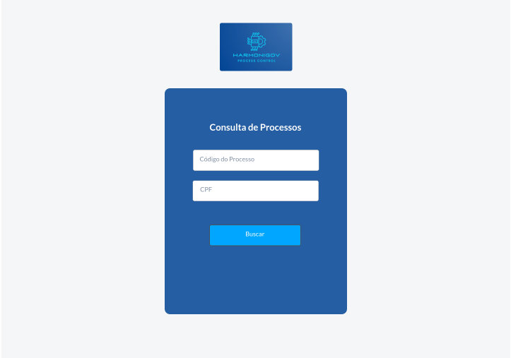
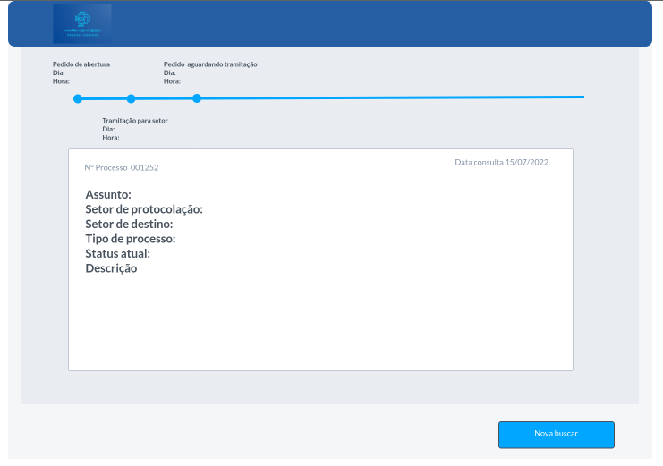
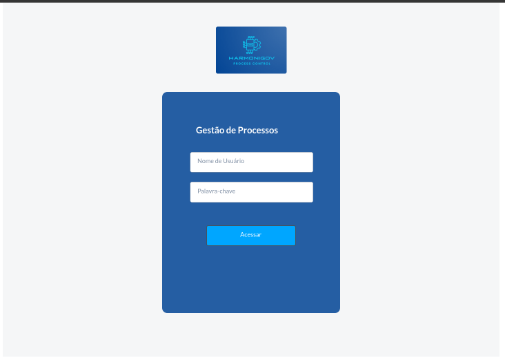
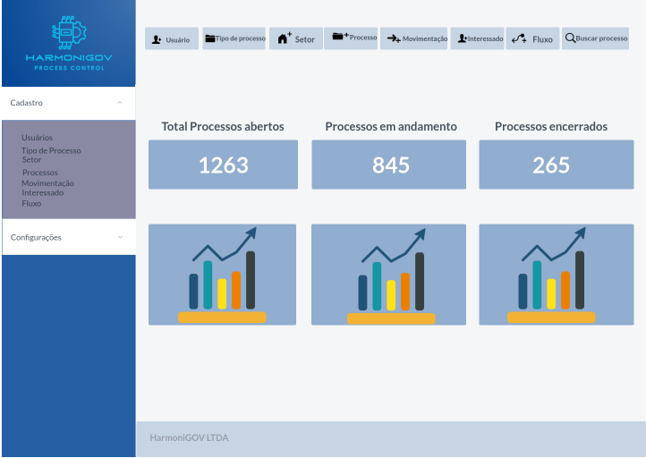

# 4. Projeto de Interface

Pré-requisitos: <a href="2-Especificação do Projeto.md"> Documentação de Especificação</a>

Visão geral da interação do usuário pelas telas do sistema e protótipo interativo das telas com as funcionalidades que fazem parte do sistema (wireframes).

 Apresente as principais interfaces da plataforma. Discuta como ela foi elaborada de forma a atender os requisitos funcionais, não funcionais e histórias de usuário abordados nas <a href="2-Especificação do Projeto.md"> Documentação de Especificação</a>.

## 4.1. Diagrama de Fluxo

### 4.1.1. Tela de entrada

### 4.1.2. Tela de cadastro padrão

### 4.1.3. Processo e trâmite

## 4.2. Wireframes

Tela - Inicial

Tela - Busca de processos

Tela - Resultado da busca

Tela - Login

Tela - DashBoard

