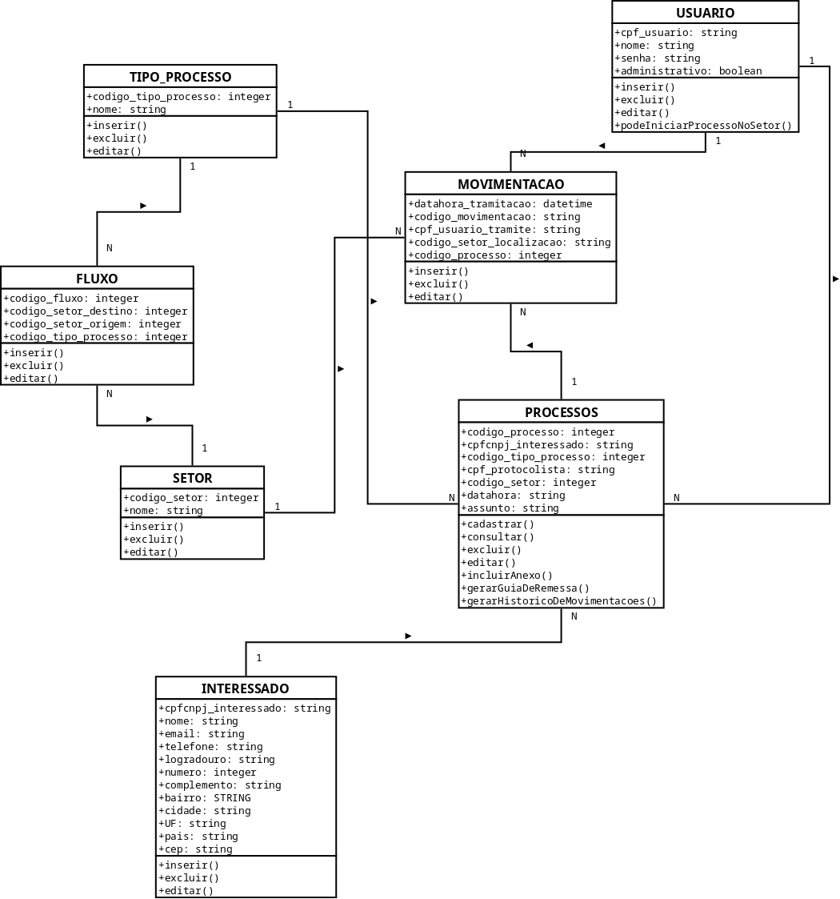

# 5. Arquitetura da Solução

Definição de como o software é estruturado em termos dos componentes que fazem parte da solução e do ambiente de hospedagem da aplicação.

## 5.1. Diagrama de Classes

## 5.2. Modelo ER (Projeto Conceitual)

## 5.3. Projeto da Base de Dados

## 5.4. Tecnologias Utilizadas

O projeto foi desenvolvido utilizando-se o MVC DOTNET 6 da Microsoft, com o uso de javascript e CSS.

## 5.5. Hospedagem

A plataforma é hospedada na Azure.

